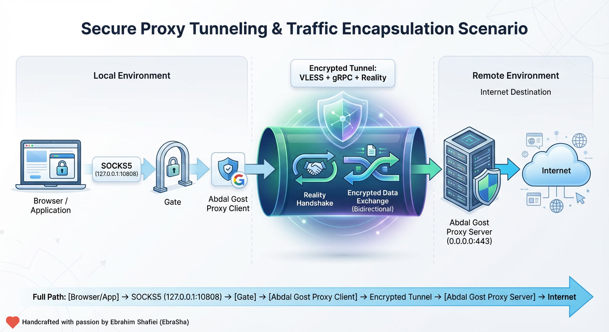

# Abdal Gost Proxy

**[English (README.md)](README.md)** | فارسی

---



---

## هدف و دلیل ساخت این نرم‌افزار

**Abdal Gost Proxy** یک سیستم پروکسی سمت کلاینت/سرور است که به شما کمک می‌کند:

- **عبور از فیلترینگ و DPI** با انتقال ترافیک روی **VLESS + gRPC** و **XTLS-Reality**، طوری که از نظر شبکه شبیه بازدید از یک سایت معتبر (مثلاً google.com یا google.com) دیده شود.
- **بدون نیاز به گواهی SSL اختصاصی** روی سرور: Reality ظاهر ترافیک را شبیه یک سایت واقعی می‌کند، بنابراین سرور به گواهی TLS خودش نیاز ندارد.
- **استفاده از یک پروکسی SOCKS5 محلی** روی رایانه؛ مرورگر یا اپلیکیشن‌ها را روی این پروکسی تنظیم می‌کنید و ترافیک از طریق تونل به سرور شما فرستاده می‌شود.

این پروژه از ایده‌های **[Gost](https://github.com/go-gost/gost)** برای مدیریت تونل و **[Xray-core](https://github.com/XTLS/Xray-core)** برای پروتکل VLESS و امنیت Reality استفاده می‌کند.

---

## امکانات و قابلیت‌ها

| قابلیت | توضیح |
|--------|--------|
| **VLESS** | پروتکل سبک برای انتقال ترافیک پروکسی. |
| **XTLS-Reality** | مخفی‌سازی پروکسی در قالب بازدید از یک سایت واقعی (مثلاً google.com) بدون گواهی SSL خودتان. |
| **gRPC (HTTP/2)** | لایه انتقال برای عبور بهتر ترافیک از DPI. |
| **اثر انگشت uTLS** | کلاینت می‌تواند خود را شبیه مرورگر (مثلاً Chrome) نشان دهد تا شناسایی کمتر شود. |
| **درگاه SOCKS5** | شنود محلی SOCKS5؛ اپلیکیشن‌ها مثل یک پروکسی معمولی از آن استفاده می‌کنند. |
| **بررسی سلامت (Health Check)** | بررسی دوره‌ای اختیاری با فاصله، زمان انتظار، تعداد تلاش و آدرس قابل تنظیم. |
| **اتصال مجدد خودکار (Re-dial)** | پس از چند بار شکست در بررسی سلامت، کلاینت تونل را مجدداً راه‌اندازی می‌کند. |
| **Fallback** | روی سرور، ترافیک بدون احراز هویت می‌تواند به یک سایت دیگر (مثلاً google.com) هدایت شود. |

---

## نحوه کارکرد


```
[مرورگر/اپ] → SOCKS5 (127.0.0.1:10808) → [گیت] → [کلاینت Abdal Gost Proxy]
                                                          ↓
                                              VLESS + gRPC + Reality
                                                          ↓
[سرور Abdal Gost Proxy] (0.0.0.0:443) ← هندشیک Reality ← [اینترنت]
```

- **سرور:** روی پورت ۴۴۳ شنود می‌کند. VLESS روی gRPC روی Reality را می‌پذیرد. اگر اتصال معتبر Reality/VLESS نباشد، می‌تواند به یک سایت واقعی (مثلاً google.com) Fallback کند.
- **کلاینت:** روی یک پورت محلی (مثلاً ۱۰۸۰۸) به صورت SOCKS5 شنود می‌کند. ترافیک را به Xray می‌فرستد؛ Xray آن را در VLESS بسته‌بندی و روی gRPC + Reality به سرور ارسال می‌کند. با فعال بودن Health Check و Re-dial، تونل پایدار می‌ماند.

---

## پیش‌نیازها

- **Go 1.21+** (برای بیلد).
- **سرور:** یک VPS یا ماشین با IP عمومی و باز بودن پورت ۴۴۳.
- **کلاینت:** ویندوز یا لینوکس؛ فایل تنظیمات در کنار فایل اجرایی.

---

## بیلد

از ریشهٔ پروژه:

```bash
# بیلد ویندوز و لینوکس و کپی تنظیمات در dist/
build-dist.bat
```

خروجی:

- `dist/windows/` — سرور، کلاینت و reality-keygen (با پسوند `.exe`) + فایل‌های نمونهٔ تنظیمات.
- `dist/linux/` — همان، بدون `.exe`.

یا به صورت دستی:

```bash
go mod tidy
go build -o abdal-gost-proxy-server.exe main.go
go build -o abdal-gost-proxy-client.exe client_main.go
go build -o reality-keygen.exe ./tools/reality-keygen
```

---

## راهنمای تنظیمات (کانفیگ)

### ۱. ساخت UUID و کلیدهای Reality

یک بار اجرا کنید:

```bash
go run ./tools/reality-keygen
```

خروجی:

- **uuid** — همان مقدار را در سرور در `users[].id` و در کلاینت در `uuid` قرار دهید.
- **private_key** — فقط سرور؛ در `abdal-gost-proxy-server.json` → `reality_settings.private_key`.
- **reality_public_key** — فقط کلاینت؛ در `abdal-gost-proxy-client.json` → `reality_public_key`.

ساخت **short_id** (مثلاً هگز):

```bash
openssl rand -hex 8
```

یک یا چند مقدار در `reality_settings.short_ids` سرور بگذارید و یکی را در `short_id` کلاینت استفاده کنید.

---

### ۲. تنظیمات سرور: `abdal-gost-proxy-server.json`

| فیلد | توضیح |
|------|--------|
| `listen_address` | آدرس شنود (مثلاً `0.0.0.0`). |
| `listen_port` | معمولاً `443`. |
| `protocol` | `vless`. |
| `users` | لیست کاربران VLESS؛ هر کدام `id` (UUID)، `email`، `flow` (برای gRPC خالی بگذارید یا حذف کنید). |
| `reality_settings.dest` | سایت:پورت Fallback وقتی اتصال معتبر نیست (مثلاً `www.google.com:443`). |
| `reality_settings.server_names` | لیست SNI (مثلاً `["www.google.com","google.com"]`). |
| `reality_settings.private_key` | خروجی reality-keygen (محرمانه). |
| `reality_settings.short_ids` | لیست short ID (مثلاً از `openssl rand -hex 8`). |
| `transport.type` | `grpc`. |
| `transport.service_name` | باید با کلاینت یکی باشد (مثلاً `abdal-grpc-stream`). |
| `transport.multi_mode` | اختیاری برای gRPC. |
| `fallback.dest` | پورت یا host:port برای Fallback در صورت نیاز. |
| `fallback.xver` | نسخه Proxy Protocol (مثلاً `0`). |

**گزینه‌های پشتیبانی‌شده (سرور):**

| گزینه | مقادیر مجاز / توضیح |
|--------|------------------------|
| `listen_address` | `0.0.0.0` (همه رابط‌ها) یا یک IP مشخص، مثلاً `192.168.1.1`. |
| `listen_port` | هر پورت آزاد؛ معمولاً `443`. |
| `protocol` | `vless` (تنها پروتکل استفاده‌شده در این سیستم). |
| `users[].flow` | با gRPC حتماً `""` (خالی) — **الزامی**. با gRPC از `xtls-rprx-vision` استفاده **نکنید**. |
| `reality_settings.dest` | رشته `"host:port"`، مثلاً `www.google.com:443`، `www.google.com:443`. باید یک سایت TLS واقعی باشد. |
| `reality_settings.server_names` | آرایهٔ رشتهٔ SNI؛ معمولاً اولین با hostname در `dest` یکی است. |
| `reality_settings.short_ids` | آرایهٔ رشته هگز (مثلاً از `openssl rand -hex 8`)؛ هر کدام ۲ تا ۱۶ کاراکتر. |
| `transport.type` | `grpc` (این سیستم فقط از gRPC استفاده می‌کند). |
| `transport.service_name` | هر رشته؛ باید با کلاینت یکی باشد. ترجیحاً نام پیش‌فرض نباشد؛ مثلاً `abdal-grpc-stream`. |
| `transport.multi_mode` | `true` یا `false`. |
| `fallback.dest` | عدد (فقط پورت، مثلاً `80`) یا رشته `"host:port"`. |
| `fallback.xver` | `0` (خاموش)، `1` یا `2` (Proxy Protocol). |

نمونهٔ کمینه:

```json
{
  "listen_address": "0.0.0.0",
  "listen_port": 443,
  "protocol": "vless",
  "users": [
    {
      "id": "YOUR-UUID-FROM-REALITY-KEYGEN",
      "email": "admin@abdal",
      "flow": ""
    }
  ],
  "reality_settings": {
    "enabled": true,
    "dest": "www.google.com:443",
    "server_names": ["www.google.com", "google.com"],
    "private_key": "YOUR_PRIVATE_KEY",
    "short_ids": ["1a2b3c4d5e6f"]
  },
  "transport": {
    "type": "grpc",
    "service_name": "abdal-grpc-stream",
    "multi_mode": true
  },
  "fallback": { "dest": 80, "xver": 0 }
}
```

**توجه:** برای انتقال gRPC، مقدار `flow` را خالی بگذارید (یا ننویسید). از `xtls-rprx-vision` همراه gRPC استفاده نکنید.

---

### ۳. تنظیمات کلاینت: `abdal-gost-proxy-client.json`

| فیلد | توضیح |
|------|--------|
| `local_port` | پورت SOCKS5 محلی (مثلاً `10808`). |
| `server_addr` | IP یا دامنهٔ سرور. |
| `server_port` | معمولاً `443`. |
| `uuid` | همان `id` کاربر در سرور. |
| `reality_public_key` | خروجی reality-keygen (کلید عمومی سرور). |
| `short_id` | یکی از `short_ids` سرور. |
| `sni` | باید با سایت Reality یکی باشد (مثلاً `www.google.com`). |
| `fingerprint` | اثر انگشت uTLS: مثلاً `chrome`، `firefox`. |
| `transport` | `grpc`. |
| `service_name` | باید با سرور یکی باشد (مثلاً `abdal-grpc-stream`). |
| `health_check` | اختیاری: `enabled`, `interval_seconds`, `timeout_seconds`, `max_retries`, `check_url`. |

**گزینه‌های پشتیبانی‌شده (کلاینت):**

| گزینه | مقادیر مجاز / توضیح |
|--------|------------------------|
| `local_port` | هر پورت آزاد ۱ تا ۶۵۵۳۵؛ معمولاً `10808`. |
| `server_addr` | IP یا دامنهٔ سرور. |
| `server_port` | معمولاً `443`. |
| `sni` | باید با سایت Reality یکی باشد (همان hostname در `reality_settings.dest` سرور)، مثلاً `www.google.com`، `www.google.com`. |
| `fingerprint` | اثر انگشت uTLS؛ یکی از: `chrome`, `firefox`, `safari`, `ios`, `android`, `edge`, `360`, `qq`, `random`. در صورت خالی بودن: `chrome`. |
| `transport` | `grpc` (این سیستم فقط از gRPC استفاده می‌کند). |
| `service_name` | باید دقیقاً با سرور یکی باشد. |
| `health_check.enabled` | `true` یا `false`. |
| `health_check.interval_seconds` | عدد مثبت؛ فاصله بین هر بررسی (مثلاً `5`). |
| `health_check.timeout_seconds` | عدد مثبت؛ زمان انتظار هر بررسی (مثلاً `3`). |
| `health_check.max_retries` | عدد مثبت؛ تعداد تلاش قبل از اتصال مجدد (مثلاً `3`). |
| `health_check.check_url` | هر آدرس HTTP(S) برای تست اتصال از طریق پروکسی (مثلاً `http://www.google.com/generate_204`). |

نمونه:

```json
{
  "local_port": 10808,
  "server_addr": "YOUR_SERVER_IP",
  "server_port": 443,
  "uuid": "YOUR-UUID",
  "reality_public_key": "YOUR_PUBLIC_KEY",
  "short_id": "1a2b3c4d5e6f",
  "sni": "www.google.com",
  "fingerprint": "chrome",
  "transport": "grpc",
  "service_name": "abdal-grpc-stream",
  "health_check": {
    "enabled": true,
    "interval_seconds": 5,
    "timeout_seconds": 3,
    "max_retries": 3,
    "check_url": "http://www.google.com/generate_204"
  }
}
```

---

## نحوه استفاده

### سرور

1. فایل `abdal-gost-proxy-server.json` را کنار فایل اجرایی سرور قرار دهید.
2. اجرا:
   - ویندوز: `abdal-gost-proxy-server.exe`
   - لینوکس: `./abdal-gost-proxy-server`
3. پورت ۴۴۳ را در فایروال باز کنید.

### کلاینت

1. فایل `abdal-gost-proxy-client.json` را کنار فایل اجرایی کلاینت قرار دهید.
2. اجرا:
   - ویندوز: `abdal-gost-proxy-client.exe`
   - لینوکس: `./abdal-gost-proxy-client`
3. پروکسی مرورگر یا سیستم را روی **SOCKS5**، آدرس **127.0.0.1**، پورت **10808** (یا همان `local_port`) تنظیم کنید.


---

## 🐛 گزارش مشکلات

اگر با مشکلی مواجه شدید یا در پیکربندی مشکل دارید، لطفاً از طریق ایمیل **Prof.Shafiei@Gmail.com** با ما در تماس باشید. همچنین می‌توانید مشکلات را در GitLab یا GitHub گزارش دهید.

---

## ❤️ حمایت مالی

اگر این پروژه برای شما مفید بود و مایل به حمایت از توسعه بیشتر هستید، لطفاً در نظر داشته باشید که کمک مالی کنید:

- [اینجا اهدا کنید](https://alphajet.ir/abdal-donation)

---

## 🤵 برنامه‌نویس

ساخته شده با عشق توسط **ابراهیم شفیعی (EbraSha)**

- **ایمیل:** Prof.Shafiei@Gmail.com  
- **تلگرام:** [@ProfShafiei](https://t.me/ProfShafiei)  
- **گیت‌هاب:** [ebrasha](https://github.com/ebrasha)  
- **لینکدین:** [profshafiei](https://www.linkedin.com/in/profshafiei/)

---

## 📜 مجوز

این پروژه تحت مجوز **GPLv2 or later** منتشر شده است.
